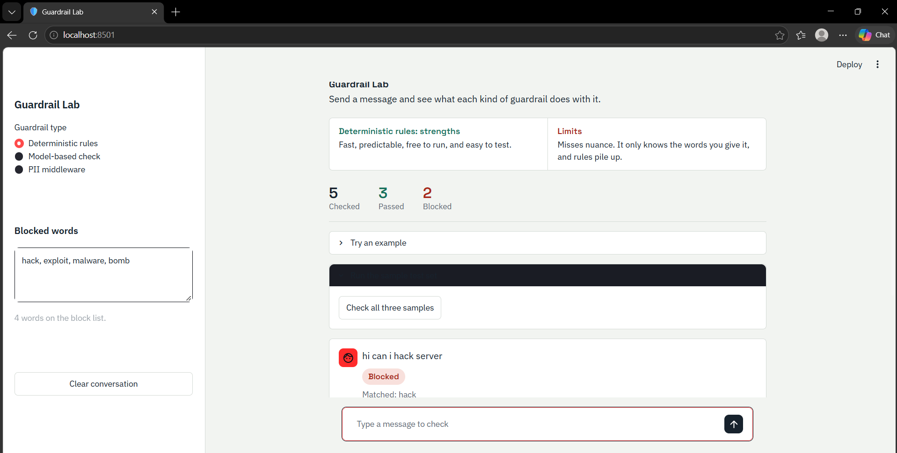
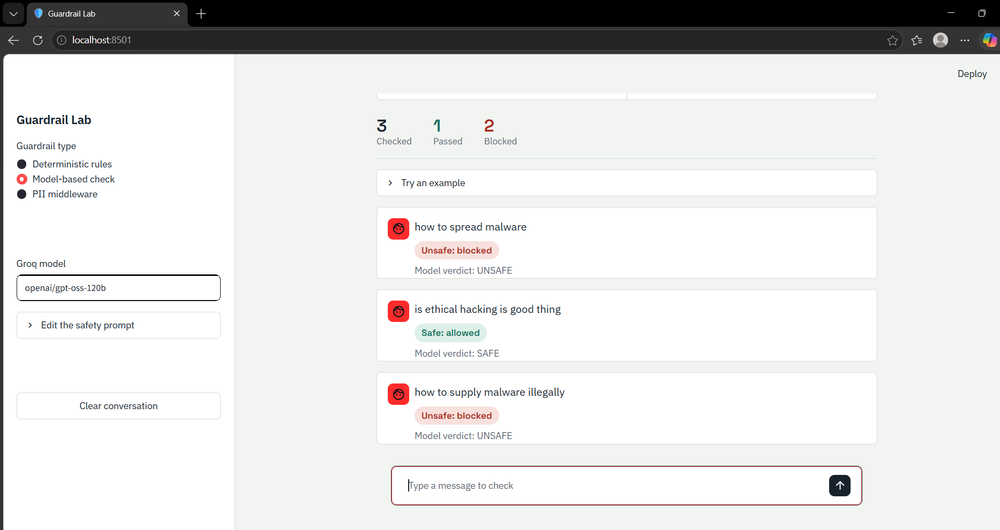
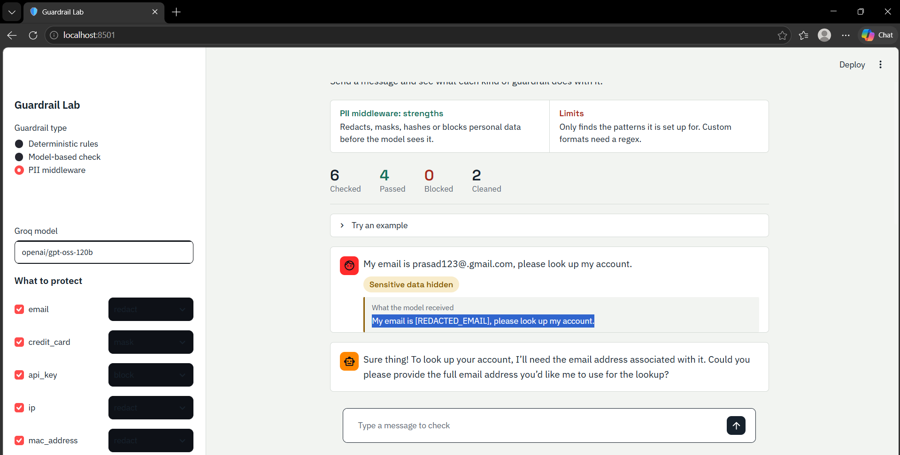

# Guardrail Lab

An interactive learning project for exploring how AI application guardrails work in practice. The repository provides a Streamlit chat interface and small standalone examples that demonstrate three complementary ways to protect an LLM application before a request is processed:

- deterministic, keyword-based rules;
- model-based safety classification using a Groq-hosted LLM; and
- LangChain PII middleware that redacts, masks, hashes, or blocks sensitive data.

Its purpose is educational: to make the trade-offs between fast, predictable rules, semantic LLM checks, and privacy controls concrete and easy to experiment with. It is a demonstration lab, not a complete production safety system.

## What is implemented

The Streamlit application (`app.py`) is the main entry point. It includes three selectable modes:

| Mode | Implementation | Behaviour |
| --- | --- | --- |
| Deterministic rules | Case-insensitive substring matching against an editable block list | Blocks a message when it contains a configured word. The default list is `hack`, `exploit`, `malware`, and `bomb`. |
| Model-based check | `ChatGroq` asks a safety prompt to return `SAFE` or `UNSAFE` | Blocks messages classified as unsafe. The model and prompt can be changed in the sidebar. |
| PII middleware | A LangChain agent uses `PIIMiddleware` before the model receives input | Protects selected PII types and displays the transformed input sent to the model. |

The PII demo enables these protections by default:

- email: redact;
- credit card: mask; and
- API keys matching `sk-` followed by 32 alphanumeric characters: block.

IP addresses, MAC addresses, and URLs can also be enabled. Each detector can use `redact`, `mask`, `hash`, or `block` (where supported by LangChain). The PII agent includes a deliberately simple `customer_lookup` demo tool and preserves the chat state for a multi-turn conversation.

The interface also provides sample prompts, a per-mode conversation history, a clear button, result counters, and a batch test for the deterministic examples.

## Guardrail approaches and screenshots

### 1. Deterministic rules

Deterministic guardrails apply explicit, predefined rules to an input. In this lab, the rule is a case-insensitive keyword block list that can be edited in the sidebar. This approach is fast, predictable, and easy to test, but it cannot understand intent or context beyond the words configured.



### 2. Model-based safety check

Model-based guardrails use an LLM to judge the meaning of a message rather than relying only on exact words. The app sends the input to a Groq-hosted model with a configurable prompt that returns `SAFE` or `UNSAFE`. This can catch more nuanced requests, but introduces API cost, latency, and the possibility of inconsistent classifications.



### 3. PII middleware

PII (Personally Identifiable Information) middleware screens input before it reaches the LangChain agent. It can redact, mask, hash, or block selected data types, such as emails, credit-card numbers, and API keys. The lab shows the cleaned version of the message that the model receives, helping demonstrate privacy protection in the request flow.



## Prerequisites

- Python 3.14 or newer, as specified in `pyproject.toml`.
- A Groq API key for the model-based and PII modes. Deterministic mode works without one.

## Setup and run

Install the dependencies with your preferred Python environment manager. For example, using `uv`:

```bash
uv sync
```

Or using `pip`:

```bash
python -m venv .venv
.venv\Scripts\activate
pip install -r requirements.txt
```

Create a `.env` file in the project root for the Groq-backed modes:

```env
GROQ_API_KEY=your_groq_api_key
```

Start the lab:

```bash
streamlit run app.py
```

Open the local URL shown by Streamlit, select a guardrail type in the sidebar, and send a message or choose one of the built-in examples.

## Standalone demos

The repository also contains focused terminal examples:

- `deterministic_guardrails.py` — keyword blocking followed by an interactive loop;
- `model_based_guardrails.py` — a Groq LLM returning `SAFE` or `UNSAFE`; and
- `PII_Guardrails.py` — a LangChain agent with PII middleware and a dummy customer lookup tool.

Run one directly after installing dependencies and configuring `GROQ_API_KEY` where required:

```bash
python deterministic_guardrails.py
python model_based_guardrails.py
python PII_Guardrails.py
```

Type `exit` (or `quit` in the PII demo) to leave the interactive loops.

## Project structure

```text
app.py                       Streamlit Guardrail Lab
deterministic_guardrails.py  Rule-based console example
model_based_guardrails.py    LLM safety-classification console example
PII_Guardrails.py            LangChain PII middleware console example
Guardrails_theory.md         Background notes on guardrail concepts
Assets/                      Images used to illustrate the demos
```

## Important limitations

The implementations are intentionally small so their behaviour is easy to inspect. Keyword matching can be bypassed or over-block valid text; model judgements add latency, cost, and inconsistency; and PII detection only protects the patterns and detector types configured. Real applications should use layered controls, add output/tool safeguards, test against relevant abuse cases, protect logs and secrets, and complete security, privacy, and compliance reviews appropriate to their domain.

## Further reading

See [Guardrails_theory.md](Guardrails_theory.md) for the repository's explanatory notes on deterministic checks, model-based validation, PII middleware, human-in-the-loop patterns, and layered guardrails.
